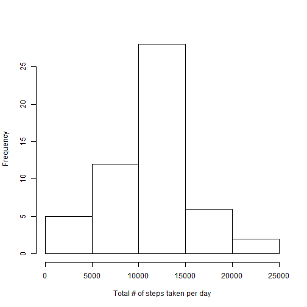
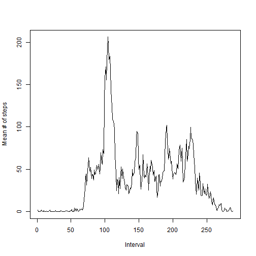
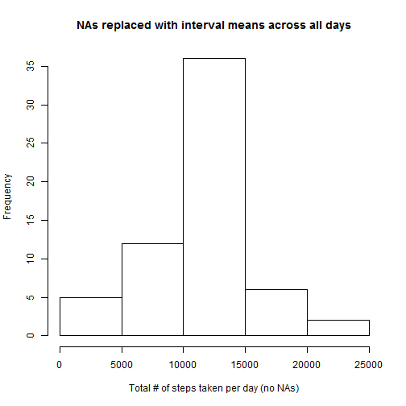
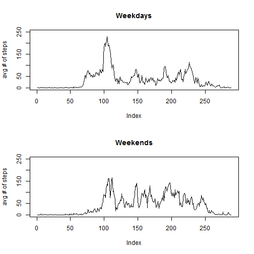

# Reproducible Research: Peer Assessment 1
========================================================

## Loading and preprocessing the data

Read the csv data file into df.activity and create a
second dataset df.activity2 that drops all NA values


```r
setwd("data")
df.activity <- read.csv("activity.csv", as.is = TRUE)
complete <- complete.cases(df.activity)
df.activity2 <- df.activity[complete,]
```

## What is mean total number of steps taken per day?

We will use tapply to create vectors containing values for
unique dates and the corresponding calculated values including
the mean # of steps, the median # of steps, and the total #
of steps for each unique day.


```r
# unique dates found in activity.csv
daily.dates <- as.factor(unique(df.activity2$date))

# calculated values required for the assignment
daily.means <- tapply(df.activity2$steps, df.activity2$date, mean)
daily.medians <- tapply(df.activity2$steps, df.activity2$date, median)
daily.total <- tapply(df.activity2$steps, df.activity2$date, sum)
```

#### Histogram of total number of steps taken each day

```r
hist(daily.total, xlab="Total # of steps taken per day", main=NULL)
```

 

#### Mean

```r
mean(daily.total)
```

```
## [1] 10766
```

#### Median

```r
median(daily.total)
```

```
## [1] 10765
```

## What is the average daily activity pattern?

We will again use tapply to calculate the average daily activity pattern.
Create a vector to hold the mean for each unique 5-minute interval
across all days found in activity.csv.


```r
interval.mean <- tapply(df.activity2$steps, df.activity2$interval, mean)
intervals.unique <- unique(df.activity2$interval)

df.interval <- data.frame(cbind(intervals.unique, interval.mean))
```

#### Average # of steps taken per interval averaged across all days

```r
# Plot the values
plot(interval.mean, type="l", xlab = "Interval", ylab="Mean # of steps")
```

 

```r
# Find interval containing maximum # of steps averaged across all days
names(which.max(interval.mean))
```

```
## [1] "835"
```


## Inputing missing values

For each interval missing a value, we will populate it with the mean of that interval
averaged across all days.


```r
# find the sum of incomplete cases from existing vector "complete"
sum(!complete)
```

```
## [1] 2304
```


```r
# replace NA values with the interval mean # of steps across all days 
df.activity$steps[which(is.na(df.activity$steps))] <- tapply(df.activity2$steps, df.activity2$interval, mean)
```


#### Create histogram of new data that contains the interval mean for originally NA values

```r
hist(tapply(df.activity$steps, df.activity$date, sum), xlab="Total # of steps taken per day (no NAs)", main="NAs replaced with interval means across all days")
```

 

#### New Mean

```r
mean(tapply(df.activity$steps, df.activity$date, sum))
```

```
## [1] 10766
```

#### New Median

```r
median(tapply(df.activity$steps, df.activity$date, sum))
```

```
## [1] 10766
```

The values differ slightly from the estimates from the first part of the assignment. The Median has increased from 10765 to 10766.

## Are there differences in activity patterns between weekdays and weekends?

Use timeDate package to find weekends

```r
install.packages("timeDate")
```

```
## Installing package into 'C:/Users/drlate/Documents/R/win-library/3.1'
## (as 'lib' is unspecified)
```

```
## Error: trying to use CRAN without setting a mirror
```

```r
library(timeDate)
```

```
## Warning: package 'timeDate' was built under R version 3.1.1
```

Convert date column to date format and use isWeekend() from timeDate to determine if it is a weekend day

```r
df.activity$date <- strptime(df.activity$date, "%Y-%m-%d")
df.activity$weekend <- isWeekend(df.activity$date)
```

Calculate the average number of steps for each interval across all days by weekend vs weekday

```r
df.weekend <- data.frame(tapply(df.activity$steps, list(df.activity$interval, df.activity$weekend), mean))
```

Graph the results

```r
par(mfrow=c(2,1))
plot(df.weekend$FALSE., type="l", ylab="avg # of steps", main="Weekdays",ylim=c(0,250))
plot(df.weekend$TRUE., type="l", ylab="avg # of steps", main="Weekends", ylim=c(0,250))
```

 
